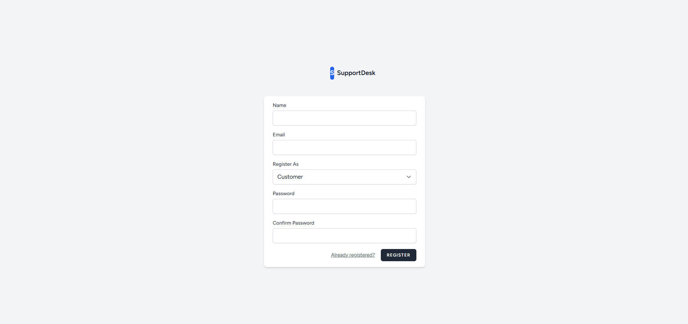
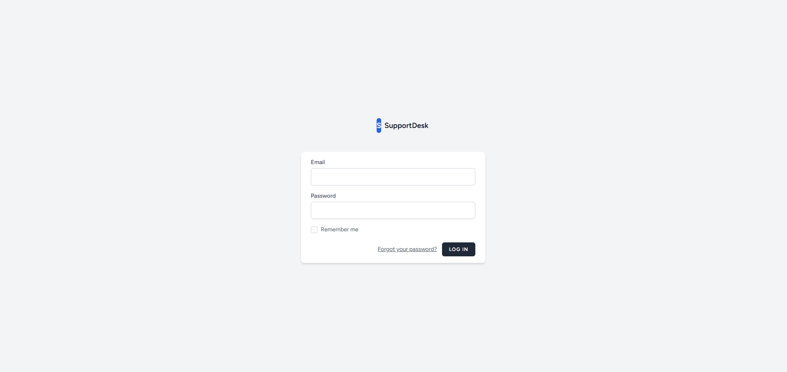
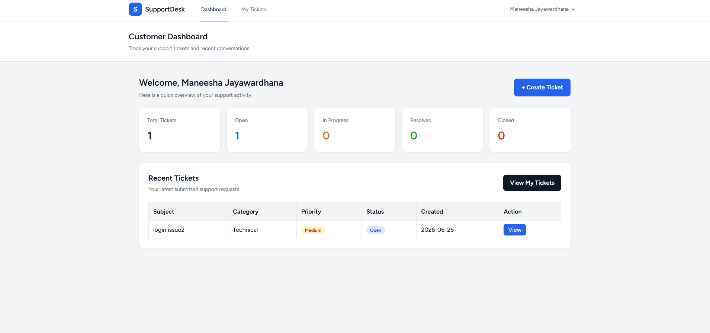
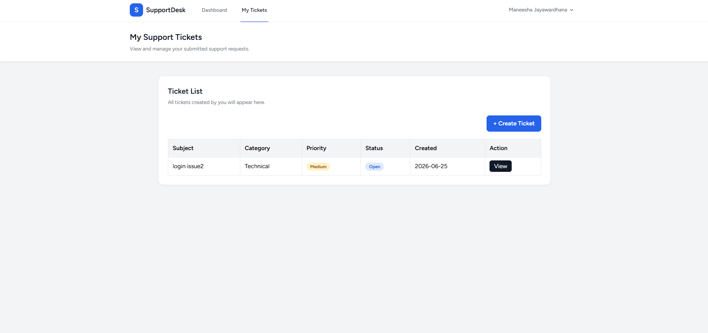
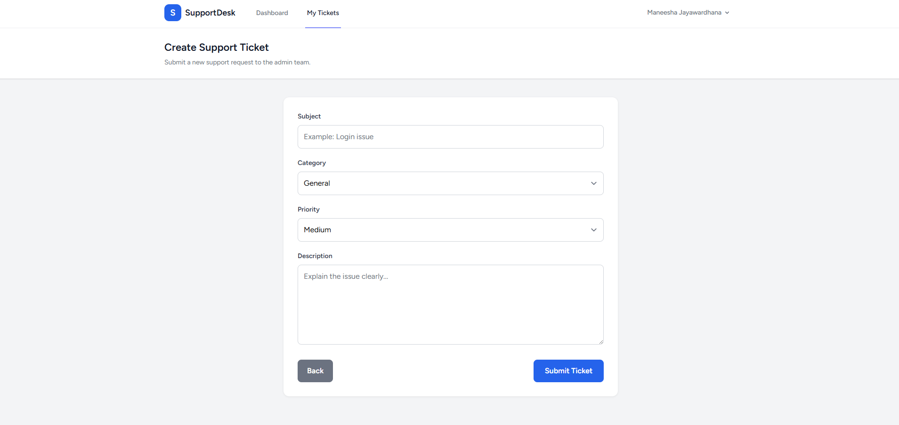
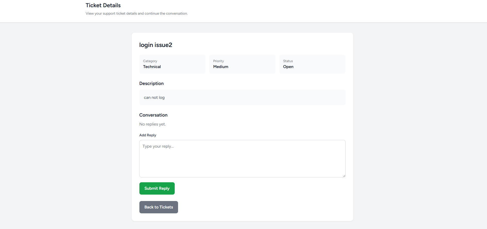
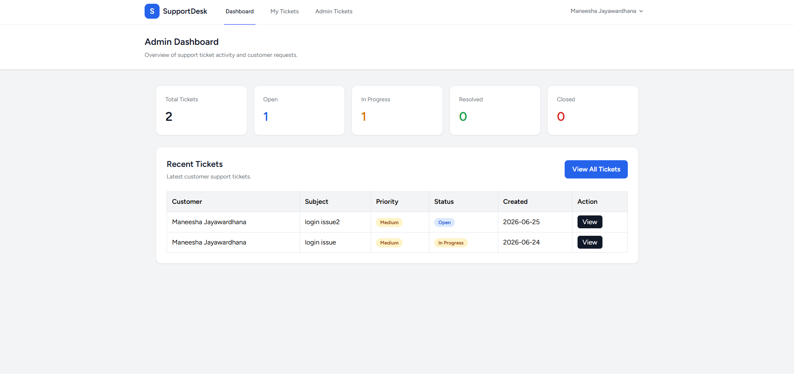

# SupportDesk - Laravel Support Ticket Dashboard

SupportDesk is a Laravel-based support ticket management system built as a portfolio project. It includes customer and admin panels, role-based access control, ticket creation, ticket filtering, status updates, and admin/customer replies.

## Features

### Customer
- Register and login as a customer
- View customer dashboard
- Create support tickets
- View own tickets
- View ticket status
- Reply to admin messages

### Admin
- Register and login as an admin
- View admin dashboard with ticket statistics
- View all customer tickets
- Filter tickets by status and priority
- Update ticket status
- Reply to customer tickets
- View ticket conversation history

## Technologies Used

- PHP
- Laravel
- MySQL
- Blade
- Tailwind CSS
- Laravel Breeze
- Git and GitHub

## Role-Based Access

The system uses a `role` column in the `users` table.

Available roles:

- `customer`
- `admin`

Admin routes are protected using middleware, so customers cannot access admin pages.

> Note: In this portfolio version, users can select their role during registration to demonstrate role-based access control. In a production system, admin account creation should be restricted.

## Screenshots

### Register Page


### Login Page


### Customer Dashboard


### My Tickets


### Create Ticket


### Customer Ticket Details


### Admin Dashboard


## Database Tables

### users
Stores user account details and role information.

Main fields:
- id
- name
- email
- password
- role

### tickets
Stores customer support tickets.

Main fields:
- id
- user_id
- subject
- description
- category
- priority
- status

### ticket_replies
Stores replies from admins and customers.

Main fields:
- id
- ticket_id
- user_id
- message

## Main Routes

### Customer Routes

```text
/dashboard
/customer/tickets
/customer/tickets/create
/customer/tickets/{ticket}
